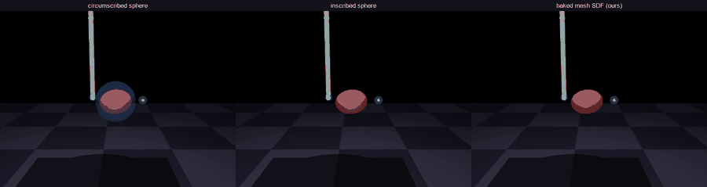
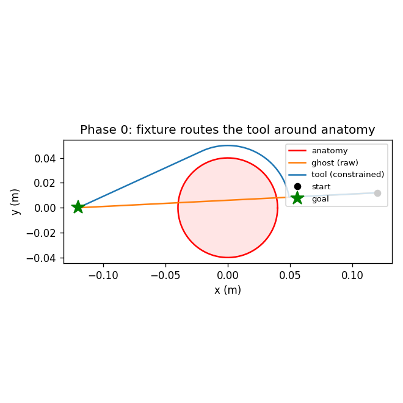
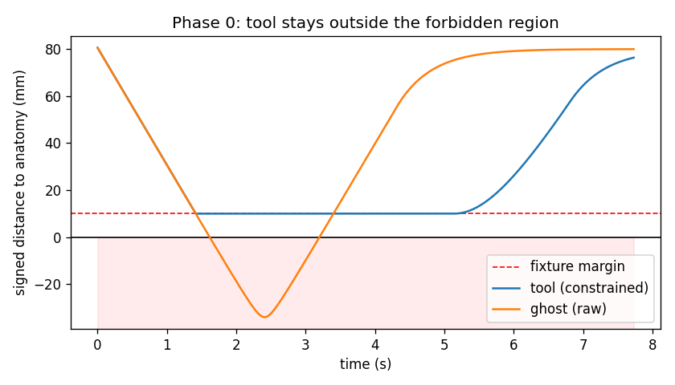
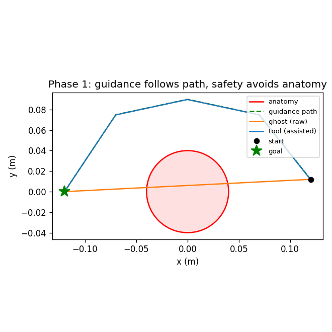
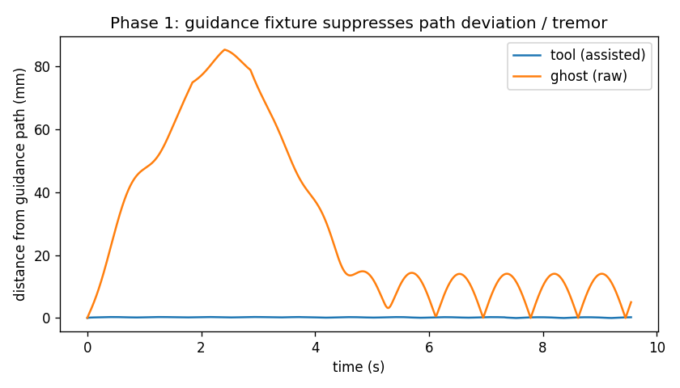
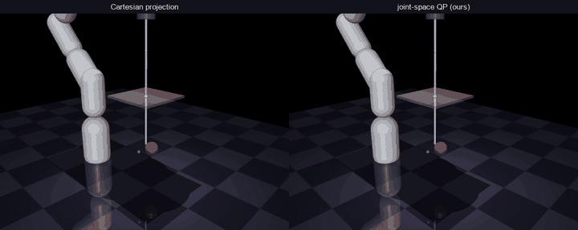
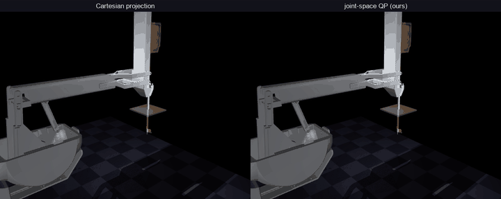
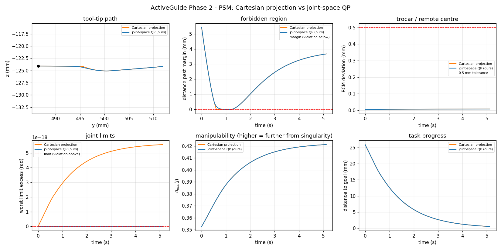
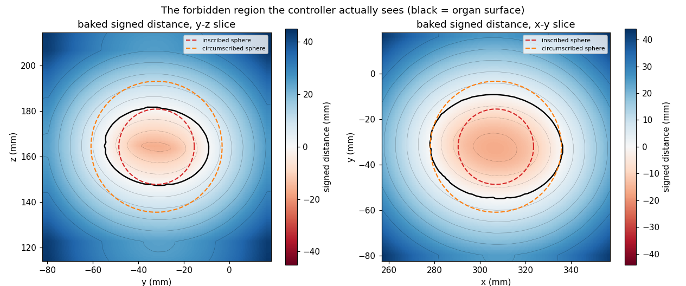
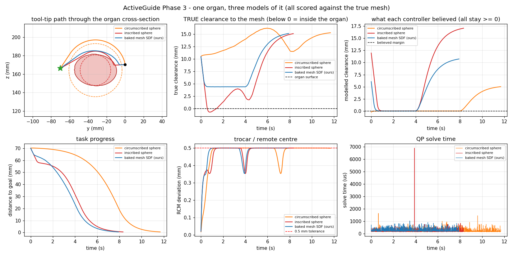

# ActiveGuide

[](LICENSE)
[](https://mujoco.org)
[](tests/)

Software/VR-assisted **virtual fixtures (active constraints)** for surgical
robot control.

The system identifies protected anatomy, builds **virtual walls**
(forbidden-region fixtures) and **guidance paths** (guidance fixtures) from it,
enforces them on the robot, and surfaces them to the surgeon through a VR UI plus
force or vibrotactile feedback.

North star (Levels of Autonomy 1–2): give a *solo* surgeon enough active
assistance to do what normally needs a second pair of hands.



*One organ, three models of it, same fixtures throughout. Left: a sphere drawn
around the organ — safe, but it swallows 55 cm³ of empty workspace. Middle: a
sphere inside it — the tool enters real tissue. Right: the organ's own distance
field.*

## Results at a glance

| phase | what it adds | headline |
|---|---|---|
| **0** | forbidden-region fixture (virtual wall) | tool held exactly at its 10 mm margin; the unassisted ghost reaches **34 mm inside** the anatomy |
| **1** | guidance fixture along a path | path error **0.22 mm vs 29.76 mm** — 135× tremor suppression |
| **2** | joint-space QP enforcement + RCM | trocar held to **0.50 mm vs 27.35 mm** for Cartesian projection — 55× tighter |
| **2b** | the real dVRK PSM | mechanical remote centre reproduced to **0.013 mm**; dropping the `<mimic>` joints costs **90.1 mm** |
| **3** | walls from segmented anatomy | inscribed sphere enters the organ by **0.68 mm**, mesh field by **0.00 mm** — at **540×** the speed of exact queries |

Every number on this page is produced by the commands below, and every table is
written by the demo that measured it (`docs/phase*_results.md`).

```bash
pip install -e ".[media]"
python tools/build_psm.py --fetch     # derive the dVRK PSM model
python -m activeguide.demo_phase0     # virtual wall
python -m activeguide.demo_phase1     # guidance fixture
python -m activeguide.demo_phase2     # Cartesian projection vs joint-space QP
python -m activeguide.demo_phase3     # sphere approximations vs a baked mesh field
python tools/make_gif.py --all        # videos -> GIFs for this page
```

---

## Phase 0 — Forbidden-Region Virtual Fixture

A signed-distance field defines the forbidden region; the fixture projects the
commanded velocity so the tool cannot cross it. The projection is dt-aware — it
caps inward speed so the *next* Euler step lands exactly on the margin — so the
tool decelerates onto the wall instead of overshooting and being pushed back.

| | |
|---|---|
|  |  |

| metric | constrained tool | unassisted ghost |
|---|---|---|
| min signed distance to anatomy | **10.00 mm** (= the margin, held exactly) | **−34.01 mm** (34 mm inside) |
| peak warning level (0..1) | 1.00 | — |
| peak rendered wall force | 0.00 N | — |

The rendered force being **zero** is the expected result, not a missing feature:
the robot-side clamp stops the tool *at* the margin, so the spring-damper never
has any penetration to push back against. Force feedback is what the operator
would feel if enforcement were disabled — the two are deliberately separate
responsibilities.

- `activeguide/sdf.py` — signed-distance primitives (sphere/plane/box/union).
- `activeguide/fixtures.py` — `ForbiddenRegionFixture`: dt-aware predictive
  velocity projection (robot-side enforcement) + spring-damper feedback force
  (MTM) + 0..1 warning level (Quest vibration / sensory substitution).
- `model/scene.xml`, `activeguide/demo_phase0.py`.

## Phase 1 — Guidance fixture + interactive teleop

The complement of a wall: motion *along* a reference path is left free (the
surgeon sets the pace), motion perpendicular to it is blended with an attraction
back onto the path. Safety composes last, so assistance can never override it.

| | |
|---|---|
|  |  |

| metric | assisted tool | raw operator input |
|---|---|---|
| mean path error | **0.22 mm** | 29.76 mm |
| min distance to anatomy | 47.85 mm (margin 10 mm) | — |

**135× tremor suppression**, and the wall still holds while guidance is active.

- `activeguide/paths.py` — `Polyline` (closest point + tangent).
- `activeguide/fixtures.py` — `GuidanceFixture`, `FixtureStack` (guidance first,
  safety clamp last).
- `activeguide/interactive.py` — GLFW teleop (hold-to-move keys, mouse camera);
  the seam where Quest master input plugs in later.

## Phase 2 — Joint-space enforcement on a real manipulator

Phases 0–1 constrained a free-floating *point* in Cartesian space (the tool was
a MuJoCo mocap body). Phase 2 puts an actual 7-DOF arm in the loop and enforces
every fixture as a **Vector Field Inequality** inside one QP per control step:

```
min_q̇   ‖J_p q̇ − v_des‖² + λ‖q̇‖²
s.t.    −J_dᵢ q̇ ≤ ηᵢ dᵢ     walls, shaft clearance, joint limits, RCM
        q̇_min ≤ q̇ ≤ q̇_max
```

so constraints are satisfied *simultaneously* rather than by last-writer-wins
ordering. `sdf.py` needed **no changes** — `sdf.normal()` is already `∇d`, and
the chain rule `J_d = ∇dᵀ J_p` turns any existing SDF primitive into a linear
constraint on joint velocity.



Identical task, fixtures, damping, velocity box and integrator; the only
difference is *where* enforcement happens:

| robot | controller | goal | wall viol. | joint lim | RCM max | σ_min(J) | p50 | p99 |
|---|---|---|---|---|---|---|---|---|
| Panda | Cartesian projection | 0.50 mm | 0.000 mm | 0.0000 rad | **27.35 mm** | 0.3035 | 28 µs | 109 µs |
| Panda | **joint-space QP** | 0.50 mm | 0.000 mm | 0.0000 rad | **0.50 mm** | 0.2988 | 165 µs | 515 µs |
| PSM | Cartesian projection | 0.50 mm | 0.000 mm | 0.0000 rad | 0.01 mm | 0.3527 | 79 µs | 261 µs |
| PSM | **joint-space QP** | 0.50 mm | 0.000 mm | 0.0000 rad | 0.01 mm | 0.3527 | 209 µs | 532 µs |

On the **Panda** the trocar constraint exists only in software, and the QP holds
it **55× tighter** — the Cartesian controller reaches the same goal while
levering the shaft 27 mm out of the port, because a fixture on the tool tip
cannot see the trocar at all.


On the **PSM** both controllers score 0.01 mm: the da Vinci's remote centre is
*mechanical*, so the parallelogram already guarantees it and the QP's RCM
constraint is redundant. That is the honest result, and a useful one — it says
joint-space enforcement is essential exactly when the constraint is not built
into the hardware, and doubles as an independent check that controller and
mechanism agree.



The layer is cross-validated against Phase 0: with `η = 1/dt` the VFI bound
reduces algebraically to the old dt-aware clamp, and the two agree to **1e-8**
in both the free and actively-clamped regimes (`tests/test_qp.py`).

- `activeguide/kinematics.py` — `mj_jacSite` wrapper, joint limits, `σ_min(J)`.
- `activeguide/constraints.py` — `SdfConstraint`, `ShaftClearanceConstraint`
  (samples the whole shaft, not just the tip), `JointLimitConstraint`,
  `RcmConstraint` (trocar pivot, ported from `panda_ik_cpp`).
- `activeguide/qp.py` — `QpController`; hard solve first, penalized slack only
  on genuine infeasibility, which is counted and reported.
- `model/scene_panda.xml` — 7-DOF Panda + 0.42 m laparoscopic shaft, trocar,
  anatomy, goal.

## Phase 2b — the real dVRK PSM

The same fixture stack runs unchanged on the actual da Vinci Patient-Side
Manipulator, derived from the official description.

**There is no official dVRK MJCF** (checked 2026-08-12: not in
`mujoco_menagerie`, not in `jhu-dvrk/dvrk_model`, not in `WPI-AIM/dvrk_env` —
published dVRK sims target CoppeliaSim, Unity, Gazebo, Isaac/USD, or PyBullet).
So `tools/build_psm.py` derives it reproducibly:

```bash
python tools/build_psm.py --fetch     # -> model/psm.xml
```

The upstream assets are **fetched, not redistributed** — `dvrk_env` has no
LICENSE file despite declaring BSD in its package manifest. See
[model/psm/NOTICE.md](model/psm/NOTICE.md).

The conversion is not mechanical. **MuJoCo's URDF importer silently ignores
`<mimic>` joints**, and the PSM's remote centre is *mechanical* — a parallelogram
whose members the URDF slaves to `pitch_back_joint`. A naive import loads without
warning, reports 13 independent DOFs instead of 6 + jaw, and is badly wrong:

| Over 75 poses (yaw × pitch × insertion) | worst RCM error |
|---|---|
| couplings applied | **0.013 mm** |
| couplings dropped (naive import) | **90.1 mm** |

The builder restores them as `<equality><joint>` constraints, and
`tests/test_psm.py::TestParallelogramIsLoadBearing` pins *both* directions so the
fix cannot be silently removed. Because MuJoCo enforces `<equality>` only in its
constraint solver during `mj_step`, while this controller integrates `q̇` itself,
the couplings are *also* imposed as exact QP equality rows
(`constraints.JointCoupling`, `PSM_COUPLING`).



## Phase 3 — walls built from segmented anatomy

Phases 0–2 protected a sphere, because a closed-form SDF was all the controller
needed. Real anatomy comes out of a CT/MR segmentation as a label volume or a
surface mesh, and is neither spherical nor convex. Approximating it with a
sphere is a trap with no good setting:



One organ, three models of it, identical fixtures — and every run scored against
the **true mesh**, never against the approximation it was driving on:

| controller's model | goal | **true clearance** | inside the organ | believed | p50 | p99 |
|---|---|---|---|---|---|---|
| circumscribed sphere | 0.50 mm *(48% longer path)* | 10.53 mm | 0.00 mm | −0.22 mm | 173 µs | 556 µs |
| inscribed sphere | 0.50 mm | **−0.68 mm** | **0.68 mm** | 0.00 mm | 175 µs | 495 µs |
| **baked mesh SDF** | 0.50 mm *(fastest)* | 4.40 mm | **0.00 mm** | 0.00 mm | 209 µs | 635 µs |

All three believed they were riding their 4 mm margin the whole time — **a
fixture cannot detect that its own model of the anatomy is wrong.**



A single run only shows what one path happened to cost, so the trade-off is also
measured path-free, by integrating each sphere's disagreement with the organ
over the whole field:

| organ volume | inscribed leaves unprotected | circumscribed denies |
|---|---|---|
| 44.6 cm³ | **25.7 cm³ (57% of the organ)** | **55.2 cm³ of free space** |

The error is in the *shape*, not the radius: inscribed 16.6 mm, circumscribed
28.8 mm, so no sphere about this centre is within **12.2 mm** of the surface
everywhere. Shrinking it only trades tissue left unprotected against workspace
needlessly denied. The mesh field removes the trade rather than balancing it.

Neither `constraints.py` nor `qp.py` needed a line changed: a baked field is an
`SDF`, so `SdfConstraint` and `ShaftClearanceConstraint` already accept it. That
is what keeping one representation since Phase 0 bought.

Three things were worth getting right:

**Exact mesh queries are not real-time.** One distance-plus-gradient evaluation
against exact geometry costs **3.5 ms**, and a control step needs one per sample
point — tip plus two shaft samples here — against a 2 ms budget for the whole
step. Baking moves that cost offline and makes the online cost independent of
mesh complexity: **6.4 µs** for the same query, a **540×** reduction, and a
200k-triangle liver queries as fast as a sphere. `rtree` is not required —
closest-triangle search runs on `scipy.spatial.cKDTree`, and the candidate
pruning is checked against brute force over every triangle rather than assumed.

**Inside/outside is where mesh SDFs go wrong,** so it is decided twice by
unrelated methods — generalised winding number for the oracle, grid flood fill
for the bake — and the bake cross-checks one against the other. A sign error
silently inverts a safety constraint into an attractor.

**Discretisation must only ever cost clearance, never borrow it.** Trilinear
interpolation rounds off the creases of a distance field and *over*-estimates
there, which is the unsafe direction. The bake measures that bound (probing
uniformly as well as near the surface, since area-weighted surface sampling
barely lands on the edges where the error lives) and the demo dilates the field
by its own measured error, so the interpolated wall is conservative by
construction.

Scoring is deliberately not self-referential: `MeshSdf` is the oracle and is
never used by the controller, so the mesh run cannot be flattered by grading it
against its own grid.

- `activeguide/anatomy.py` — `MeshSdf` (exact closest-triangle distance, the
  *oracle*), `bake_mesh` (mesh → grid), `bake_labels` (segmentation label volume
  → grid, straight through `distance_transform_edt`, no meshing step),
  `make_phantom`, and mesh loading with unit scaling and hole repair.
- `activeguide/sdf.py` — `VoxelSdf`: the baked field. Trilinear lookup with an
  analytic gradient, and a conservative closed form outside the baked box.
- `tools/build_anatomy.py` — bakes and caches; `--mesh liver.stl --scale 0.001`
  for real data.
- `model/scene_panda_anatomy.xml` — the Panda scene with the organ as a mesh.

## Roadmap
- **Phase 1** Guidance fixtures + interactive teleop. *(done; Quest viz pending)*
- **Phase 2** Joint-space QP enforcement + RCM. *(done)*
- **Phase 2b** The real dVRK PSM, mechanical RCM. *(done)*
- **Phase 2c** Swappable feedback: dVRK MTM force vs. Quest vibration.
- **Phase 3** Build walls from segmented anatomy (CT/mesh → offset → SDF). *(done)*
- **Phase 4** AI task recognition selects which fixtures are active.
- **Phase 5** "Second-person" features (camera / retraction / next-step).
- **Phase 6** User study: solo+system vs. solo vs. two-person.

## Stack & requirements

| | |
|---|---|
| **Language** | Python 3.11+ (developed on 3.14) |
| **Physics** | [MuJoCo](https://mujoco.org) ≥ 3.9 |
| **Viewer / input** | `glfw` (interactive teleop window, mouse camera) |
| **Numerics** | `numpy`, `scipy` |
| **QP controller** | `qpsolvers` ≥ 4.13 with `daqp` (default) / `quadprog` |
| **Geometry** | `trimesh` (mesh I/O + phantom); `scipy` does the SDF bake |
| **Plots / media** | `matplotlib`, and `imageio` + `pillow` for video and GIFs |
| **Tests** | `unittest` (stdlib) |
| **Target hardware** | dVRK (MTM force feedback) + Meta Quest (vibrotactile) — Phase 2+ |

Runs headless for verification and plotting; `--view` opens the GLFW window and
needs a GPU/display. `logs/` output is regenerable and not tracked; the copies
under `docs/` are what this page shows.

## Setup
```powershell
python -m venv .venv
.\.venv\Scripts\python.exe -m pip install -r requirements.txt
```

## Run
```powershell
# Phase 0 — virtual wall (headless verify + plots, then live)
.\.venv\Scripts\python.exe -m activeguide.demo_phase0
.\.venv\Scripts\python.exe -m activeguide.demo_phase0 --view
# Phase 1 — guidance + wall (headless, then interactive teleop)
.\.venv\Scripts\python.exe -m activeguide.demo_phase1
.\.venv\Scripts\python.exe -m activeguide.demo_phase1 --view   # WASD/QE move, mouse camera
# Phase 2 — Cartesian projection vs joint-space QP, on both robots
.\.venv\Scripts\python.exe -m activeguide.demo_phase2
.\.venv\Scripts\python.exe -m activeguide.demo_phase2 --no-video   # plots only, clean timings
# Phase 3 — segmented anatomy: sphere approximations vs the baked mesh field
.\.venv\Scripts\python.exe tools\build_anatomy.py                  # optional: demo bakes on first run
.\.venv\Scripts\python.exe tools\build_anatomy.py --mesh liver.stl --scale 0.001
.\.venv\Scripts\python.exe -m activeguide.demo_phase3
# build the dVRK PSM model (fetches upstream assets; needed for the PSM tests)
.\.venv\Scripts\python.exe tools\build_psm.py --fetch
# turn the comparison videos into GIFs for the README
.\.venv\Scripts\python.exe tools\make_gif.py --all
# tests (135: 24 from Phases 0-1, 40 for the QP layer, 17 for the PSM,
#        46 for the anatomy pipeline, 8 for the video captions. The PSM
#        tests skip cleanly if model/psm.xml has not been built; every
#        other test builds what it needs in-process.)
.\.venv\Scripts\python.exe -m unittest discover -s tests -v
```

Solve times are quoted from `--no-video` runs. Interleaving the renderer into
the control loop roughly doubles them, and is not what a controller does.

## Key references
- Bowyer, Davies & Rodriguez y Baena, *Active Constraints / Virtual Fixtures:
  A Survey*, IEEE T-RO 2014.
- Marinho et al., *Dynamic Active Constraints for Surgical Robots Using Vector
  Field Inequalities*, IEEE T-RO 2019.
- Jacobson, Kavan & Sorkine-Hornung, *Robust Inside-Outside Segmentation using
  Generalized Winding Numbers*, ACM TOG 2013.
- Yang et al., *Medical robotics—Regulatory, ethical, and legal considerations
  for increasing levels of autonomy*, Science Robotics 2017.
- AMBF (JHU/WPI), dVRK/CRTK; datasets: JIGSAWS, Cholec80.
