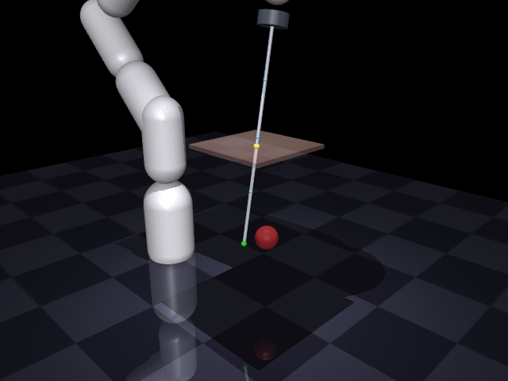
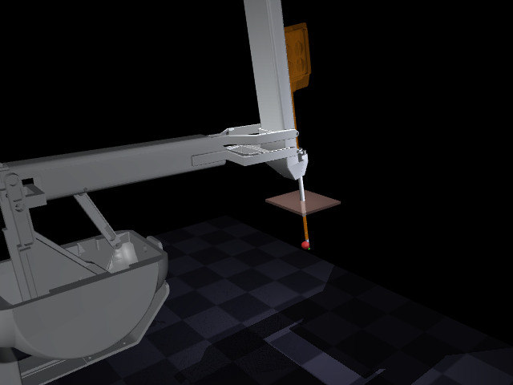
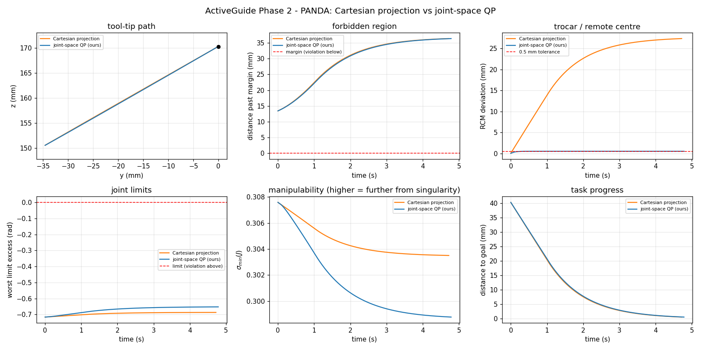

# ActiveGuide

[](LICENSE)
[](https://mujoco.org)
[](tests/)

Software/VR-assisted **virtual fixtures (active constraints)** for surgical
robot control.

| Franka Panda (software RCM) | dVRK PSM (mechanical RCM) |
|---|---|
|  |  |

**Headline result** — identical task, fixtures, damping, velocity box and
integrator; the only difference is *where* enforcement happens:

| robot | controller | goal | wall viol. | RCM max | p99 solve |
|---|---|---|---|---|---|
| Panda | Cartesian projection | 0.50 mm | 0.000 mm | **27.35 mm** | 524 µs |
| Panda | **joint-space QP** | 0.50 mm | 0.000 mm | **0.50 mm** | 1548 µs |
| PSM | Cartesian projection | 0.50 mm | 0.000 mm | 0.01 mm | 1254 µs |
| PSM | **joint-space QP** | 0.50 mm | 0.000 mm | 0.01 mm | 2237 µs |

On the **Panda** the trocar constraint exists only in software, and the QP holds
it **55× tighter** — the Cartesian controller reaches the same goal while
levering the shaft 27 mm out of the port, because a fixture on the tool tip
cannot see the trocar at all.

On the **PSM** both controllers score 0.01 mm: the da Vinci's remote centre is
*mechanical*, so the parallelogram already guarantees it and the QP's RCM
constraint is redundant. That is the honest result, and a useful one — it says
joint-space enforcement is essential exactly when the constraint is not built
into the hardware, and doubles as an independent check that controller and
mechanism agree.



Reproduce (video also written to `logs/`):

```bash
pip install -e ".[media]"
python tools/build_psm.py --fetch          # derive the dVRK PSM model
python -m activeguide.demo_phase2          # -> logs/phase2_*.png, *.mp4, results.md
``` The system identifies protected anatomy, builds **virtual walls**
(forbidden-region fixtures) and **guidance paths** (guidance fixtures) from it,
enforces them on the robot, and surfaces them to the surgeon through a VR UI plus
force or vibrotactile feedback.

North star (Levels of Autonomy 1–2): give a *solo* surgeon enough active
assistance to do what normally needs a second pair of hands.

## Status — Phases 0–1 (done)
**Phase 0 — Forbidden-Region Virtual Fixture (virtual wall):**
- `activeguide/sdf.py` — signed-distance primitives (sphere/plane/box/union).
- `activeguide/fixtures.py` — `ForbiddenRegionFixture`: dt-aware predictive
  velocity projection (robot-side enforcement) + spring-damper feedback force
  (MTM) + 0..1 warning level (Quest vibration / sensory substitution).
- `model/scene.xml` — tool, protected sphere, goal.
- `activeguide/demo_phase0.py` — drives the tool at the anatomy; the fixture
  routes it around without ever penetrating.

**Phase 1 — Guidance fixture + interactive teleop:**
- `activeguide/paths.py` — `Polyline` (closest point + tangent).
- `activeguide/fixtures.py` — `GuidanceFixture` (assist along a path,
  anisotropic strength) and `FixtureStack` (guidance first, safety clamp last).
- `activeguide/interactive.py` — GLFW teleop (hold-to-move keys, mouse camera);
  the seam where Quest master input plugs in later.
- `activeguide/demo_phase1.py` — guidance routes the tool along an arc over the
  anatomy; suppresses operator tremor ~135× (0.22 mm vs 29.8 mm path error).

**Phase 2 — Joint-space enforcement on a real manipulator (in progress):**
Phases 0–1 constrained a free-floating *point* in Cartesian space (the tool was
a MuJoCo mocap body). Phase 2 puts an actual 7-DOF arm in the loop and enforces
every fixture as a **Vector Field Inequality** inside one QP per control step:

```
min_q̇   ‖J_p q̇ − v_des‖² + λ‖q̇‖²
s.t.    −J_dᵢ q̇ ≤ ηᵢ dᵢ     walls, shaft clearance, joint limits, RCM
        q̇_min ≤ q̇ ≤ q̇_max
```

so constraints are satisfied *simultaneously* rather than by last-writer-wins
ordering. `sdf.py` needed **no changes** — `sdf.normal()` is already `∇d`, and
the chain rule `J_d = ∇dᵀ J_p` turns any existing SDF primitive into a linear
constraint on joint velocity.

- `activeguide/kinematics.py` — `mj_jacSite` wrapper, joint limits, `σ_min(J)`.
- `activeguide/constraints.py` — `SdfConstraint`, `ShaftClearanceConstraint`
  (samples the whole shaft, not just the tip), `JointLimitConstraint`,
  `RcmConstraint` (trocar pivot, ported from `panda_ik_cpp`).
- `activeguide/qp.py` — `QpController`; hard solve first, penalized slack only
  on genuine infeasibility, which is counted and reported.
- `model/scene_panda.xml` — 7-DOF Panda + 0.42 m laparoscopic shaft, trocar,
  anatomy, goal.

Measured on the Panda reach task (2 ms control step): **zero** wall and
joint-limit violations, RCM deviation **≤ 500 µm** (the requested radial
tolerance, hit exactly), 0% infeasible solves, p50/p99 solve time **355/1317 µs**.

The new layer is cross-validated against Phase 0: with `η = 1/dt` the VFI bound
reduces algebraically to the old dt-aware clamp, and the two agree to **1e-8**
in both the free and actively-clamped regimes (`tests/test_qp.py`).

**Phase 2b — the real dVRK PSM.** The same fixture stack runs unchanged on the
actual da Vinci Patient-Side Manipulator, derived from the official description.

**There is no official dVRK MJCF** (checked 2026-08-12: not in
`mujoco_menagerie`, not in `jhu-dvrk/dvrk_model`, not in `WPI-AIM/dvrk_env` —
published dVRK sims target CoppeliaSim, Unity, Gazebo, Isaac/USD, or PyBullet).
So `tools/build_psm.py` derives it reproducibly:

```bash
python tools/build_psm.py --fetch     # -> model/psm.xml
```

The upstream assets are **fetched, not redistributed** — `dvrk_env` has no
LICENSE file despite declaring BSD in its package manifest. See
[model/psm/NOTICE.md](model/psm/NOTICE.md).

The conversion is not mechanical. **MuJoCo's URDF importer silently ignores
`<mimic>` joints**, and the PSM's remote centre is *mechanical* — a parallelogram
whose members the URDF slaves to `pitch_back_joint`. A naive import loads without
warning, reports 13 independent DOFs instead of 6 + jaw, and is badly wrong:

| Over 75 poses (yaw × pitch × insertion) | worst RCM error |
|---|---|
| couplings applied | **0.013 mm** |
| couplings dropped (naive import) | **90.1 mm** |

The builder restores them as `<equality><joint>` constraints, and
`tests/test_psm.py::TestParallelogramIsLoadBearing` pins *both* directions so the
fix cannot be silently removed. Because MuJoCo enforces `<equality>` only in its
constraint solver during `mj_step`, while this controller integrates `q̇` itself,
the couplings are *also* imposed as exact QP equality rows
(`constraints.JointCoupling`, `PSM_COUPLING`).

Measured driving the PSM tip through the port with wall + joint-limit + RCM
fixtures: goal reached to **0.3 mm**, worst RCM deviation **≈7 µm** (structural,
far tighter than the 500 µm the constraint permits), coupling residual
**4e-16 rad/s**, zero violations, 0% infeasible, p50/p99 **485/1716 µs**.

This gives the benchmark a genuine contrast: on the Panda the RCM must be
enforced *in software*; on the PSM it is *mechanical* and the same constraint
becomes an independent check that controller and mechanism agree.

## Roadmap
- **Phase 1** Guidance fixtures + interactive teleop. *(done; Quest viz pending)*
- **Phase 2** Joint-space QP enforcement + RCM. *(Panda + dVRK PSM done)*
- **Phase 2b** Swappable feedback: dVRK MTM force vs. Quest vibration.
- **Phase 3** Build walls from segmented anatomy (CT/mesh → offset → SDF).
- **Phase 4** AI task recognition selects which fixtures are active.
- **Phase 5** "Second-person" features (camera / retraction / next-step).
- **Phase 6** User study: solo+system vs. solo vs. two-person.

## Stack & requirements

| | |
|---|---|
| **Language** | Python 3.11+ (developed on 3.14) |
| **Physics** | [MuJoCo](https://mujoco.org) ≥ 3.9 |
| **Viewer / input** | `glfw` (interactive teleop window, mouse camera) |
| **Numerics** | `numpy`, `scipy` |
| **QP controller** | `qpsolvers` ≥ 4.13 with `daqp` (default) / `quadprog` |
| **Geometry** | `trimesh` (Phase 3 — anatomy meshes → SDF) |
| **Plots** | `matplotlib` (writes to `logs/`) |
| **Tests** | `unittest` (stdlib) |
| **Target hardware** | dVRK (MTM force feedback) + Meta Quest (vibrotactile) — Phase 2+ |

Runs headless for verification and plotting; `--view` opens the GLFW window and
needs a GPU/display. `logs/` output is regenerable and not tracked.

## Setup
```powershell
python -m venv .venv
.\.venv\Scripts\python.exe -m pip install -r requirements.txt
```

## Run
```powershell
# Phase 0 — virtual wall (headless verify + plots, then live)
.\.venv\Scripts\python.exe -m activeguide.demo_phase0
.\.venv\Scripts\python.exe -m activeguide.demo_phase0 --view
# Phase 1 — guidance + wall (headless, then interactive teleop)
.\.venv\Scripts\python.exe -m activeguide.demo_phase1
.\.venv\Scripts\python.exe -m activeguide.demo_phase1 --view   # WASD/QE move, mouse camera
# build the dVRK PSM model (fetches upstream assets; needed for the PSM tests)
.\.venv\Scripts\python.exe tools\build_psm.py --fetch
# tests (81: 24 from Phases 0-1, 40 for the QP layer, 17 for the PSM.
#        the PSM tests skip cleanly if model/psm.xml has not been built)
.\.venv\Scripts\python.exe -m unittest discover -s tests -v
```

## Key references
- Bowyer, Davies & Rodriguez y Baena, *Active Constraints / Virtual Fixtures:
  A Survey*, IEEE T-RO 2014.
- Yang et al., *Medical robotics—Regulatory, ethical, and legal considerations
  for increasing levels of autonomy*, Science Robotics 2017.
- AMBF (JHU/WPI), dVRK/CRTK; datasets: JIGSAWS, Cholec80.
